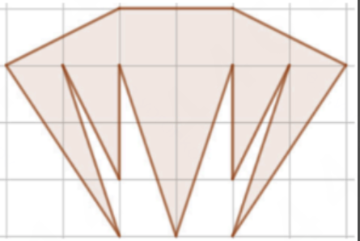

# Question 41: Figure Area on a Grid

**Тема:** Базовая математическая грамотность

Same problem as [Q39](Q39_Grid_Figure_Area.md). This file records an **incorrect** solution that yields 18, and why it is wrong.

## Problem Statement

**RU:** Посчитайте площадь фигуры на картинке. Длина одной стороны квадрата — 1 см.

**EN:** Calculate the area of the figure in the picture. The length of one side of a square is 1 cm.

## Correct answer

**12** (see Q39 for the full decomposition, shoelace, and Pick’s theorem).

The visible grid is **6 squares wide and 4 squares tall**, not 8-wide.

---

## The 18 solution (incorrect)

That write-up split the figure at the waist and computed:

1. **Top trapezoid:** top side 4, bottom side 8, height 1  
   $\frac{4+8}{2} \times 1 = 6$
2. **Three downward triangles** of height 3:  
   bases 3, 2, 3 → $4.5 + 3 + 4.5 = 12$
3. **Total:** $6 + 12 = 18$

It also claimed Pick’s theorem with $I = 13$, $B = 12$, which again gives 18 — but those lattice counts do not match this figure.

### Where it goes wrong

| Claim in the 18 solution | What the figure actually is |
|--------------------------|-----------------------------|
| Waist is 8 squares wide | Waist is **6** (from $(0,3)$ to $(6,3)$) |
| Top edge is 4 squares wide | Top edge is **2** (from $(2,4)$ to $(4,4)$) |
| Top trapezoid area 6 | $\frac{2+6}{2} = \mathbf{4}$ |
| Left/right spikes are $3 \times 3$ triangles (area 4.5 each) | Outer triangles have base 1, height 3 → area **1.5** each; extra inner triangles of area **1** each sit beside the verticals at $x=2$ and $x=4$ |
| Bottom is only three height-3 triangles (area 12) | Bottom total is **8**, including inner triangles and **excluding** the unshaded notches between the teeth |
| $I=13$, $B=12$ | $I=5$, $B=16$ → $5 + 8 - 1 = 12$ |

The 18 solution overcounts the top by 2 (wrong width) and the bottom by 4 (fills the notches and uses the wrong bases). $2 + 4 = 6$, and $18 - 6 = 12$.

---

## Correct decomposition (short)

- Top trapezoid $(0,3),(2,4),(4,4),(6,3)$: area $4$
- Left outer $(0,3),(2,0),(1,3)$: $1.5$
- Left inner $(1,3),(2,1),(2,3)$: $1$
- Middle $(2,3),(3,0),(4,3)$: $3$
- Right inner $(4,3),(4,1),(5,3)$: $1$
- Right outer $(5,3),(4,0),(6,3)$: $1.5$

$$4 + 1.5 + 1 + 3 + 1 + 1.5 = 12$$

**Final answer: 12**
