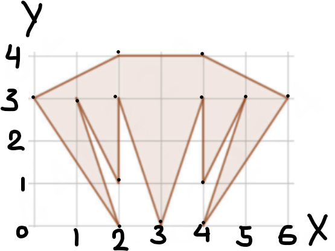

# Q44: Area of a Figure on a 6×4 Grid

**Тема:** Базовая математическая грамотность

## Problem Statement

**Russian:** Посчитайте площадь фигуры на картинке. Длина одной стороны квадрата — 1 см.

**English:** Calculate the area of the figure in the picture. The side of one grid square is 1 cm.

**Instructions:** If the answer is a decimal, round it to two decimal places. Example: `50` (integer) or `50.12` (rounded decimal).

**Given:**
- The grid is **6 squares wide and 4 squares tall**
- Each square has side **1 cm**, so 1 square unit = 1 cm²
- Origin at the bottom-left lattice point
- Vertices of the figure, in boundary order:

$$(0,3),\ (2,0),\ (1,3),\ (2,1),\ (2,3),\ (3,0),\ (4,3),\ (4,1),\ (5,3),\ (4,0),\ (6,3),\ (4,4),\ (2,4)$$

The last vertex connects back to $(0,3)$. The figure is symmetric about the vertical line $x = 3$.

---

## Answer

**12**

The area of the shaded figure is **12** cm².

---

## Theory: Area of a Polygon on a Grid

Because every cell is $1 \times 1$, the area in square units is the answer in cm².

| Method | When to use |
|--------|-------------|
| **Decomposition** | Split into a trapezoid and triangles whose bases and heights sit on grid lines |
| **Shoelace formula** | Vertices are known in boundary order (this is the most direct method here) |
| **Pick’s theorem** | $A = I + B/2 - 1$ with interior and boundary lattice points |

### Shoelace formula

For a simple polygon with vertices $(x_1,y_1),\ldots,(x_n,y_n)$ in order around the boundary, closing with $(x_{n+1},y_{n+1}) = (x_1,y_1)$:

$$A = \frac{1}{2} \left| \sum_{i=1}^{n} (x_i y_{i+1} - x_{i+1} y_i) \right|$$

Equivalently:

$$A = \frac{1}{2} \left| \sum_{i=1}^{n} x_i y_{i+1} - \sum_{i=1}^{n} y_i x_{i+1} \right|$$

The order may be clockwise or counterclockwise; the absolute value makes the sign irrelevant.

### Common mistakes

1. **Miscounting the grid** — it is 6 wide × 4 tall. Reading it as 8-wide or 10-wide inflates the area (that is how the wrong answers 18 and 20 appear).
2. **Treating the bottom as three full-height triangles** — the three tips do not fill the whole strip under $y = 3$. There are extra inner triangles that stop at $y = 1$, and unshaded notches between the teeth.
3. **Counting only full squares** — many cells are cut by diagonals.
4. **Using vertices in the wrong order** — shoelace needs consecutive boundary vertices, not an arbitrary list.

---

## How to Solve (Step by Step)

Two independent methods are enough: decomposition (easy to see on the picture) and shoelace (uses the given coordinates directly). Pick’s theorem is a third check.

### Step 1: Split the figure at $y = 3$

The widest horizontal cross-section is the line $y = 3$, from $(0,3)$ to $(6,3)$. Cut there.

- **Above** $y = 3$: one trapezoid.
- **Below** $y = 3$: five triangles (left outer, left inner, center, right inner, right outer). Left and right match by symmetry about $x = 3$.

### Step 2: Top trapezoid ($y = 3$ to $y = 4$)

Vertices: $(0,3),\ (2,4),\ (4,4),\ (6,3)$.

Two parallel horizontal sides:
- top: $4 - 2 = 2$
- bottom: $6 - 0 = 6$
- height: $1$

$$A_{\text{top}} = \frac{2 + 6}{2} \cdot 1 = 4$$

### Step 3: Five pieces below $y = 3$

**Left outer triangle** $(0,3),\ (2,0),\ (1,3)$:

$$A = \frac12 \bigl| 0(0-3) + 2(3-3) + 1(3-0) \bigr| = \frac12 \cdot 3 = 1.5$$

(The two vertices on $y = 3$ are 1 unit apart, and the third vertex is 3 units below that line, so $\frac12 \cdot 1 \cdot 3 = 1.5$.)

**Left inner triangle** $(1,3),\ (2,1),\ (2,3)$  
Vertical side of length $2$ at $x = 2$, horizontal distance $1$:

$$A = \frac12 \cdot 1 \cdot 2 = 1$$

**Central triangle** $(2,3),\ (3,0),\ (4,3)$  
Base $2$ on the line $y = 3$, height $3$:

$$A = \frac{2 \cdot 3}{2} = 3$$

**Right inner triangle** $(4,3),\ (4,1),\ (5,3)$ — mirror of the left inner triangle: area $1$.

**Right outer triangle** $(5,3),\ (4,0),\ (6,3)$ — mirror of the left outer triangle: area $1.5$.

$$A_{\text{bottom}} = 1.5 + 1 + 3 + 1 + 1.5 = 8$$

### Step 4: Add the parts

$$A = A_{\text{top}} + A_{\text{bottom}} = 4 + 8 = 12$$

The result is an integer, so no rounding is needed.

---

## Verification: Shoelace Formula

Use the given vertices in boundary order, then return to the start:

$$
\begin{align*}
&(0,3),\ (2,0),\ (1,3),\ (2,1),\ (2,3),\ (3,0),\ (4,3),\\
&(4,1),\ (5,3),\ (4,0),\ (6,3),\ (4,4),\ (2,4),\ (0,3)
\end{align*}
$$

| $i$ | $(x_i, y_i)$ | $(x_{i+1}, y_{i+1})$ | $x_i y_{i+1}$ | $y_i x_{i+1}$ |
|-----|----------------|------------------------|---------------|---------------|
| 1 | $(0,3)$ | $(2,0)$ | $0$ | $6$ |
| 2 | $(2,0)$ | $(1,3)$ | $6$ | $0$ |
| 3 | $(1,3)$ | $(2,1)$ | $1$ | $6$ |
| 4 | $(2,1)$ | $(2,3)$ | $6$ | $2$ |
| 5 | $(2,3)$ | $(3,0)$ | $0$ | $9$ |
| 6 | $(3,0)$ | $(4,3)$ | $9$ | $0$ |
| 7 | $(4,3)$ | $(4,1)$ | $4$ | $12$ |
| 8 | $(4,1)$ | $(5,3)$ | $12$ | $5$ |
| 9 | $(5,3)$ | $(4,0)$ | $0$ | $12$ |
| 10 | $(4,0)$ | $(6,3)$ | $12$ | $0$ |
| 11 | $(6,3)$ | $(4,4)$ | $24$ | $12$ |
| 12 | $(4,4)$ | $(2,4)$ | $16$ | $8$ |
| 13 | $(2,4)$ | $(0,3)$ | $6$ | $0$ |
| **Σ** | | | **96** | **72** |

$$A = \frac12 \lvert 96 - 72 \rvert = \frac12 \cdot 24 = 12$$

Same result as the decomposition.

---

## Verification: Pick’s Theorem

$$A = I + \frac{B}{2} - 1$$

**Boundary lattice points $B$:** 13 vertices, plus 3 extra points that lie on edges:
- $(2,2)$ on the vertical edge from $(2,1)$ to $(2,3)$
- $(4,2)$ on the vertical edge from $(4,3)$ to $(4,1)$
- $(3,4)$ on the top edge from $(4,4)$ to $(2,4)$

Every other edge has $\gcd(\lvert\Delta x\rvert, \lvert\Delta y\rvert) = 1$, so no extra lattice points. Thus $B = 16$.

**Interior lattice points $I$:** $(3,3),\ (1,2),\ (3,2),\ (5,2),\ (3,1)$ — five points.

$$A = 5 + \frac{16}{2} - 1 = 5 + 8 - 1 = 12$$

---

## Why 18 and 20 are wrong

Both wrong answers use the same *shape* but the wrong grid size, and they fill notches that are not shaded.

| Source | Grid assumed | Top trapezoid | Bottom | Total |
|--------|----------------|---------------|--------|-------|
| **This solution** | 6 × 4 (actual) | $(2+6)/2 = 4$ | $8$ | **12** |
| Q41 | 8-wide waist | $(4+8)/2 = 6$ | three height-3 triangles $4.5+3+4.5=12$ | **18** |
| earlier misread | 10-wide waist | $(4+10)/2 = 7$ | $13$ | **20** |

---

## Summary

| Part | Area (cm²) |
|------|------------|
| Top trapezoid | 4 |
| Two outer triangles | $1.5 + 1.5 = 3$ |
| Two inner triangles | $1 + 1 = 2$ |
| Central triangle | 3 |
| **Total** | **12** |

Shoelace on the given coordinates and Pick’s theorem both confirm **12**.

**Final answer: 12**
